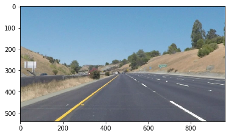
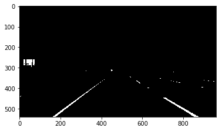
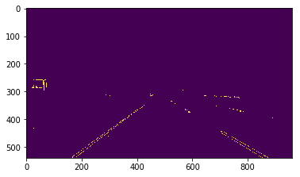
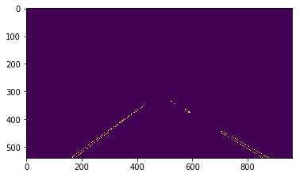
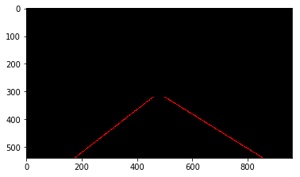
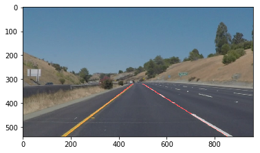

# Self-Driving Car Engineer Nanodegree

## Project: **Finding Lane Lines on the Road** 

The goals / steps of this project are the following:
* Make a pipeline that finds lane lines on the road (using only basic computer vision tools)

### 1. Algorithm description

The input video frames are processed by a pipeline which returns the original image overlaid by the detected left and right lane. Then the output is saved to another file.

My pipeline consisted of 5 steps:
 1) Dominantly yellow and white pixels are converted to white (RBG 255,255,255). All other color set to black (RBG 0,0,0).
    
 2) Canny edge detection is used on the output of the first step. Gauss smoothing used by the called OpenCV function so it was
    not implemented prior to this step.
    
 3) A mask is setting all pixel to black outside the region of interest.
    This region includes the vehicle's lane, the left and the right lane markings. Small strips outside the lane markings are 
    also included to provide robustness when the vehicle is at the edge of the lane or the road is curved.
    The camera is mounted a bit off center on the test videos. This offset was taken into consideration.
    Features, which are further than ~50 m from the vehicle, are not included in the region of interest.
    
 4) Hough transformation is used to detect line segments correlating to the left and right lanes.
    Multiple segment is usually detected for both lane. The line segments separated by their slope. Lines with below average 
    slope: Right lane; Others: Left lane. The two population then averaged separately to get an estimation for the left and 
    right lane.
    Lines representing these lanes are drawn on the image inplace (mutates the image) in the region of interest.
    
 5) The detected lanes are overlaid on the original frame. 
    

### 2. Potential shortcomings of current pipeline

The implemented code has multiple shortcoming:
 1) It can't handle close vehicle in the same lane, too many missing lane marking, additional markings, snow, ice, other 
    contaminations or huge potholes.
 2) It can't handle non yellow or white lane markings.
 3) Low robustness in case of curvy roads (small radius curves).
 4) Left and right lane estimation algorithm can be deceived by unusual line segments (pseudo findings or missing finding on one 
    lane)
 5) Left and right lane estimation algorithm can run on error if it tries to divide by 0 in case of unusual line segments.
 

### 3. Suggestions for possible improvements

A possible improvement would be to segment the region of interest to close, middle and far section and analyses them separately.

Another potential improvement could be to discard unlikely line segments before estimating the left and right lanes. A better exception handling is also recommended.

